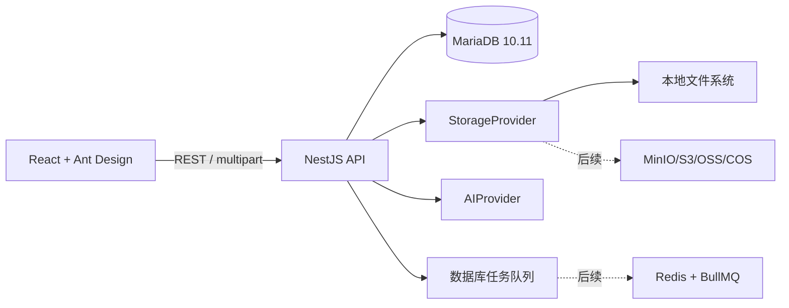

# 2D Game Asset Studio 架构设计

## 目标

平台以稳定业务 ID 管理 2D 游戏素材，从生成、上传、登记、版本、关系到 Phaser 3 导出形成闭环。前后端独立部署，所有密钥仅存在于服务端环境变量。

## 总体架构

## 目录结构

- `apps/web`：React、TypeScript、Vite、Ant Design、Zustand、Axios、PixiJS。
- `apps/api`：NestJS、Prisma、Swagger、校验、统一异常、文件与导出服务。
- `prisma`：数据库 schema、migration、seed。
- `storage`：开发环境文件根目录，不提交业务文件。
- `docs`：数据库、资源、AI、导出和地图规范。

## 后端边界

- `catalog`：游戏、版本、关卡、素材类型、风格、素材及素材版本。
- `files`：上传与 `StorageProvider` 抽象。
- `generation`：设计规格、最终 Prompt、异步任务、结果登记与 AIProvider。
- `relations`：资源依赖及正向/反向查询。
- `exports`：完整性检查、Manifest、Phaser 清单、ZIP。
- `maps`：Map/MapVersion 数据及 `MapEditorAdapter` 扩展契约。

第一阶段任务由数据库状态驱动并在进程内执行；任务结构保留 `attempt_count`、`max_attempts` 和 provider payload，迁移至 BullMQ 时不改变外部 API。

## 安全与运维

- 管理员模式使用服务端 `ADMIN_TOKEN`，浏览器不接触 AI 或数据库密钥。
- 上传文件采用随机存储键，业务关系通过 ID 记录。
- 生产环境运行 migration 而非 `db push` 或 `synchronize`。
- 日志过滤密钥；错误响应包含 request id，不回传堆栈。

