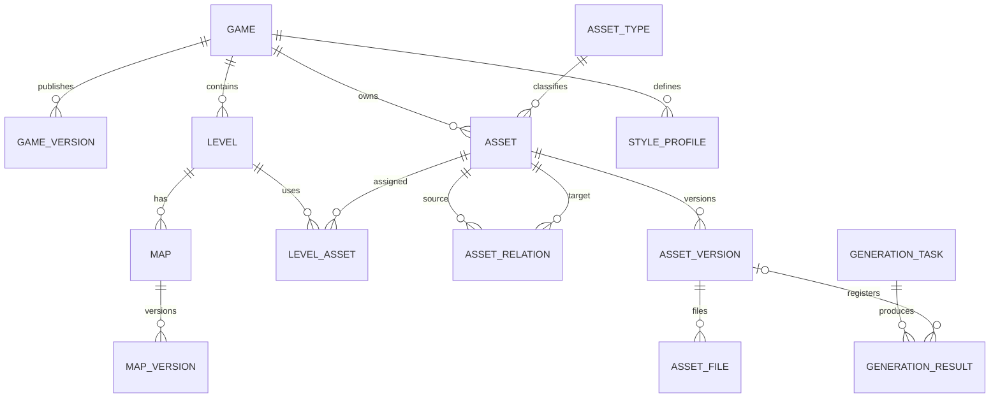

# 数据库设计

## 1. 设计目标

模型支持多游戏、多关卡、稳定业务资源 ID、不可变发布版本、文件追踪、AI 可复现、资源关系查询、完整导出以及未来地图编辑器。MariaDB 10.11 为唯一事实源，文件系统只保存二进制。

## 2. 核心实体

`Game` 与 `GameVersion` 管游戏发布线；`Level` 隶属游戏；`AssetType` 为可维护字典；`Asset` 是稳定业务身份；`AssetVersion` 是不可覆盖的内容快照；`AssetFile` 记录物理文件；`LevelAsset` 与 `AssetRelation` 记录使用关系；`StyleProfile`、`PromptTemplate`、`GenerationTask`、`GenerationResult` 保存生成上下文；`ExportTask` 保存导出；`Map`、`MapVersion` 预留地图领域。

## 3. 实体关系图

## 4. 表结构说明

- `games`：`game_id`、名称、描述、状态、当前版本。
- `game_versions`：游戏版本号、发布状态、配置快照。
- `levels`：`level_id`、游戏、显示名称、排序、配置、状态。
- `asset_types`：`type_id`、名称、分类、允许文件类型、启用状态。
- `assets`：`asset_id`、游戏、类型、显示名称、描述、状态、标签、当前版本。
- `asset_versions`：顺序版本号、父版本、Design Spec、Prompt、StyleProfile 快照、生成元数据、状态。
- `asset_files`：版本、用途、provider、storage key、原名、MIME、大小、SHA-256、公开路径。
- `asset_relations`：源素材、目标素材、关系类型、排序和元数据。
- `level_assets`：关卡、素材、可选指定版本、用途及配置。
- `style_profiles`：完整美术规范和递增版本。
- `prompt_templates`：类型化模板及变量定义。
- `generation_tasks/results`：异步状态、输入、模型参数、重试、错误、候选结果。
- `export_tasks`：范围、版本选择、完整性结果、文件路径、状态。
- `maps/map_versions`：地图业务 ID、关卡、格式、画布、图层与地图文件。

## 5. 主键规范

内部关联使用 `BIGINT UNSIGNED AUTO_INCREMENT` 对应 Prisma `BigInt`；外部永不暴露其语义。业务引用与导出使用唯一字符串 ID。

## 6. 外键规范

所有关联建立真实外键；业务记录默认 `RESTRICT` 防误删，版本子项可在永久清理时 `CASCADE`。软删除不会触发级联。

## 7. 唯一索引规范

`game_id`、`level_id`、`asset_id`、`type_id`、`style_id`、`map_id` 全局唯一；游戏版本 `(game_id, version)`、素材版本 `(asset_id, version_number)`、地图版本 `(map_id, version_number)` 唯一；关卡素材与素材关系按语义组合唯一。

## 8. 普通索引规范

状态、外键、创建时间、素材 `(game_id,type_id,status)`、任务 `(status,created_at)`、关系 source/target 均建索引，支持列表筛选、反向引用和任务扫描。

## 9. JSON 字段使用边界

JSON 只保存结构多变且无需跨记录约束的快照或配置，例如 Design Spec、模型参数、地图图层、颜色、标签；身份、状态、版本、关系必须是独立字段/表。

## 10. 软删除规范

业务主表使用 `deleted_at`；默认查询排除。存在依赖或已发布记录不能直接删除，先废弃。文件物理删除由独立清理任务执行。

## 11. 时间字段规范

核心表均有 UTC `created_at`、`updated_at`，可删除业务表另有 `deleted_at`；发布使用 `published_at`，任务使用 started/finished 时间。

## 12. 素材版本规范

版本号为递增整数，展示为 `v001`。已发布版本不可更新内容；新生成、编辑和文件替换均创建子版本并记录 `parent_version_id`。

## 13. 发布状态规范

素材和版本使用 `draft/review/published/deprecated`；游戏版本使用 `draft/published/archived`；只有通过完整性检查的版本才能发布/导出。

## 14. 游戏与素材关系

素材必须有直接 `game_id`；跨游戏复用通过复制登记或未来共享库显式处理，不依赖文件路径。

## 15. 关卡与素材关系

`level_assets` 表记录用途、固定版本和局部配置。未固定版本时导出解析素材当前已发布版本。

## 16. 素材之间的引用关系

`asset_relations` 支持 `uses_skill/uses_projectile/uses_vfx/uses_audio/drops_item/upgrades_to/summons_enemy/belongs_to_game/used_by_level/depends_on/variant_of`，源和目标均为稳定 Asset 外键，可执行正反向与删除前依赖查询。

## 17. AI 生成任务设计

任务保存 provider、模型、完整 Prompt、负面 Prompt、Design Spec、参考文件 ID、参数、seed、StyleProfile 版本和状态。状态为 `draft/queued/processing/succeeded/failed/cancelled`，重试递增 attempt 并保留错误摘要。

## 18. 文件记录设计

`asset_files`/生成结果记录 provider 与 storage key、用途、MIME、字节、SHA-256。路径不是业务主键；同一物理内容可用 Hash 检测但不自动合并业务记录。

## 19. 导出记录设计

`export_tasks` 保存 `game/level` 范围、选择的业务版本、schema 版本、完整性报告、ZIP 文件和 Hash，保证导出可审计和重放。

## 20. 地图扩展设计

`maps` 绑定游戏与可选关卡，`map_versions` 保存格式、尺寸、tile size、图层/对象配置及主文件。tileset 与 map 同时也是 Asset，通过关系绑定；未来适配器读写 Tiled TMJ，不把地图退化成背景图。

## 21. 数据迁移和兼容策略

所有修改以追加 migration 发布，禁止生产 `db push`/自动同步。字段重命名采用新增—回填—双读—切换—后续移除；Manifest 包含 `schemaVersion`，读取器至少兼容上一版本。表名和已发布字段含义保持稳定。

